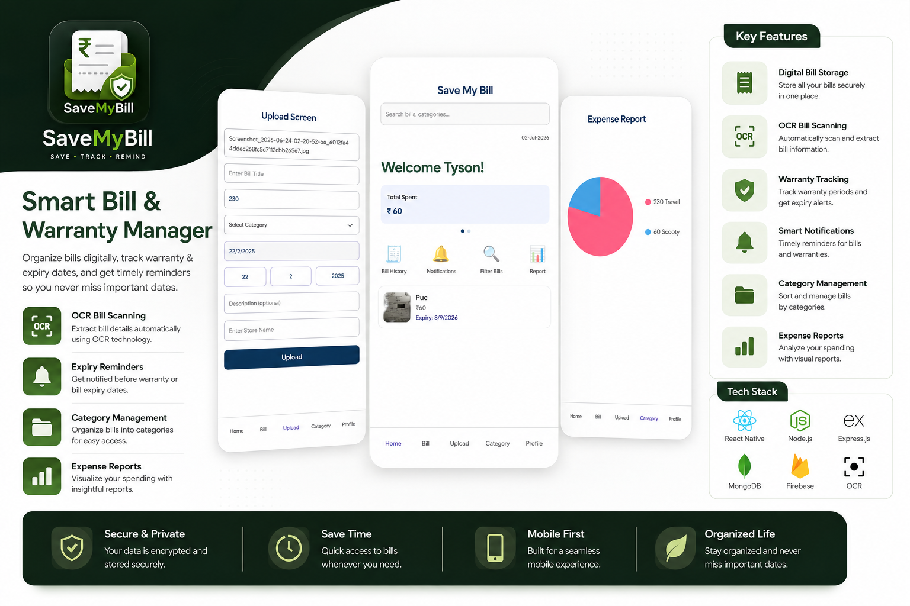
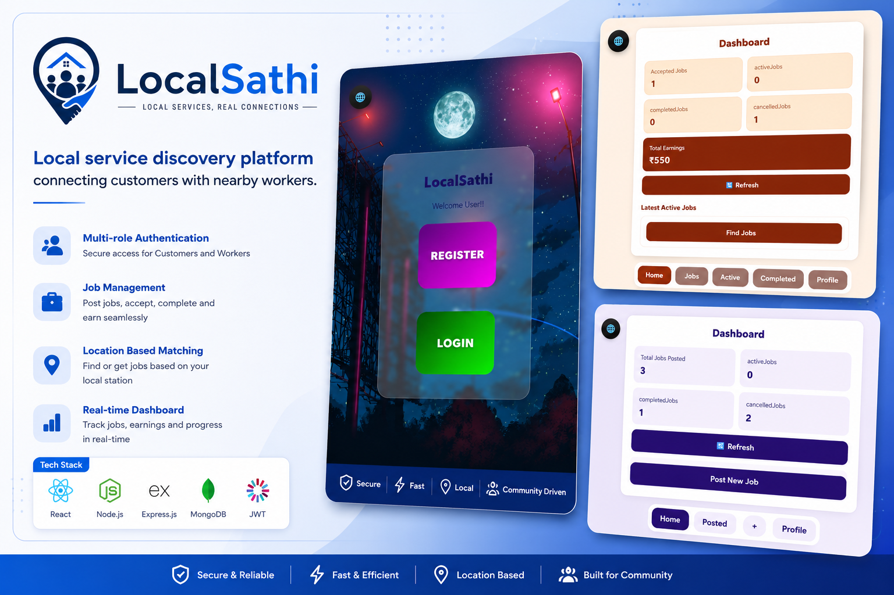
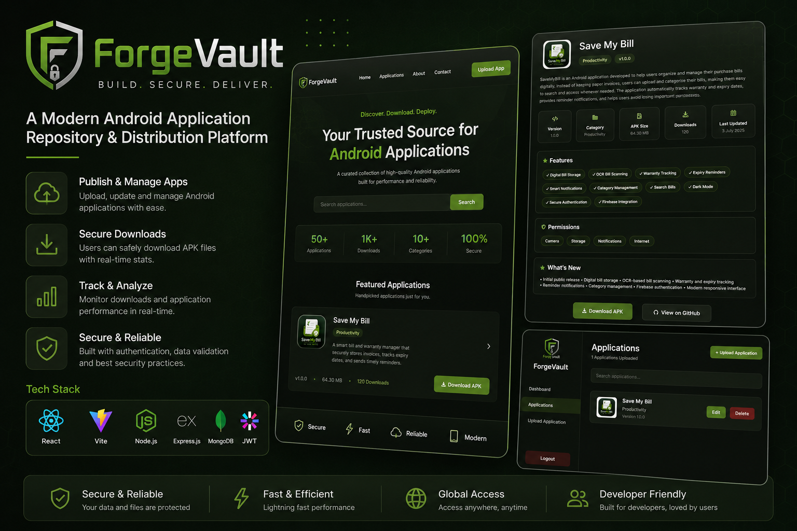

<h1 align="center">Hi 👋, I'm Shreyash Phanse</h1>

<h3 align="center">
Software Engineer • Full Stack Developer
</h3>

Building scalable web and mobile applications that solve real-world problems.

---

# 💻 About Me

- 🎓 Pursuing **B.Sc. Computer Science (2023–2026)**

- 💼 Passionate about building scalable **Full Stack Web and Mobile Applications**

- 🚀 Experienced in developing and deploying complete applications using modern JavaScript technologies

- ⚙️ Strong interest in Backend Engineering, REST API Development and System Design

- 📱 Enjoy building real-world applications that solve practical problems and deliver clean user experiences

- 🌱 Currently expanding my knowledge in scalable architectures, cloud deployment and software engineering best practices

- 🎯 Actively seeking **Software Engineer**, **Backend Developer** and **Full Stack Developer** opportunities

---

# 🛠 Tech Stack

## 💻 Languages

- JavaScript (ES6+)
- Python
- Java
- SQL
- HTML5
- CSS3

---

## 🎨 Frontend

- React.js
- React Native
- Vite
- Expo
- React Navigation
- React Native Paper

---

## ⚙️ Backend

- Node.js
- Express.js
- REST APIs
- JWT Authentication
- Multer
- Axios

---

## 🗄 Database & Authentication

- MongoDB Atlas
- Mongoose
- Firebase Authentication

---

## 🧰 Tools & Platforms

- Git
- GitHub
- VS Code
- Postman
- Render
- Figma
- Android Studio
- Expo CLI

---

# 🚀 Featured Projects

<table>

<tr>

<td width="45%" align="center">

</td>

<td width="55%" valign="top">

<h3>📱 SaveMyBill</h3>

An OCR-powered Android application that securely stores purchase bills, automatically extracts bill details, tracks warranty and expiry dates, generates expense reports, and sends reminder notifications through an intuitive mobile interface.

<b>🛠 Tech Stack</b>

 

React Native • Expo • Node.js • Express.js • MongoDB Atlas • Firebase Authentication • Python • Flask • OpenCV

  

&nbsp;

</td>

</tr>

<tr>

<td width="45%" align="center">

</td>

<td width="55%" valign="top">

<h3>🌍 LocalSathi</h3>

A full-stack local service discovery platform connecting customers with nearby workers through role-based authentication, worker discovery, service management, dashboard analytics, and complete CRUD functionality.

<b>🛠 Tech Stack</b>

 

React.js • Node.js • Express.js • MongoDB Atlas • Firebase Authentication • REST APIs

  

&nbsp;

</td>

</tr>

<tr>

<td width="45%" align="center">

</td>

<td width="55%" valign="top">

<h3>📦 ForgeVault</h3>

A modern Android application repository built for publishing, managing and distributing APKs through a responsive web platform featuring secure administrator authentication, application management, download tracking, automatic APK metadata handling, and a polished user experience.

<b>🛠 Tech Stack</b>

 

React • Vite • Node.js • Express.js • MongoDB Atlas • JWT Authentication • Multer • Render

  

&nbsp;

</td>

</tr>

</table>

---

# 📈 GitHub Activity

---

# 🌱 Current Focus

- 🚀 Full Stack Development

- ⚙️ Backend Engineering

- 🏗️ System Design

- 🔗 REST API Development

- 📱 Mobile Application Development

- 🧩 Data Structures & Algorithms

- ☁️ Cloud Deployment & Scalable Applications

---

# 📫 Let's Connect

I'm always excited to collaborate on interesting projects, discuss software engineering, explore new technologies, or connect with fellow developers. Whether it's an opportunity, an open-source project, or just a technical discussion, feel free to reach out!

&nbsp;

&nbsp;

---

# 📌 Currently Working On

- 📦 Expanding **ForgeVault** with additional applications and new platform features.
- 📱 Building production-ready Full Stack and Mobile applications.
- 🧠 Strengthening knowledge in scalable backend architecture and system design.
- 🚀 Preparing for Software Engineer and Full Stack Developer opportunities.

---

# 🤝 Open To

- Software Engineering Roles
- Full Stack Development Roles
- Backend Development Roles
- Freelance Projects
- Open Source Contributions
- Technical Collaborations

---

# 💭 Favorite Quote

> **"First, solve the problem. Then, write the code."**  
> **– John Johnson**

---

⭐ Thanks for visiting my profile!

If you enjoyed exploring my work, consider checking out my repositories or connecting with me.

<b>Code • Learn • Build • Improve</b>

